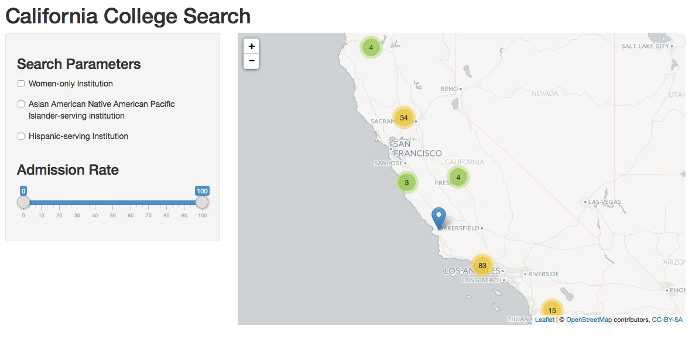

## College Scorecard Data


The United States Department of Education publishes information for secondary (college and universities) higher education institutions. Ostensibly this data is designed to help students and parents make decisions about college selections. In the course of doign this, the Department has collected a wide variety of variables over several years. From the website: 

_The College Scorecard is designed to increase transparency, putting the power in the hands of the public - from those choosing colleges to those improving college quality - to see how well different schools are serving their students._


There is also a front-end to the data already developed here: https://collegescorecard.ed.gov/data/

In this projects, a subset of the data is used to search for information on colleges in the state of California. 

--- .class #id 
## More on Scorecard Data

The complete College Scorecard dataset is approximately 170.7MB and contains data for 1996-2013. There is a wide variety of information available including data on:

* Location
* Test scores of incoming students
* Starting salaries by major for specific degrees granted by the institution
* Specialized attributes for institutions: religious affiliation, single sex institutions, etc. 

The website which contains the data used for this project can be found here: https://collegescorecard.ed.gov/data/


--- .class #id 

## California Scorecard Search

For this assignment, a searchable interface is provided to allow users to search for a subset of California colleges and universities using two sets of searchable parameters: 

1. A set of specific attributes for colleges and universities
>- Asian American Native American Pacific Islander-serving institution
>- Hispanic-serving institution
>- Women-only college

2. Admission rates: The upper and lower range for admission  percentages. 

--- .class #id 

## Sample output 


```{r, cache=FALSE,echo=FALSE,warning=FALSE}

library(UsingR)
library(shiny)
library(leaflet)
library(rgdal)
library(maps)
library(shiny)
library(jsonlite)

# Read college data 2013 data - see https://collegescorecard.ed.gov/data/
# for more information. Note this is one years data: 2013
CollegeScore<-read.csv("..\\MERGED2013_PP.csv",stringsAsFactors = FALSE)

#
# Fields of interest from this data set: 
#   - State of California
#   - Latitude and Longitude
#   - Admission Rate (%) scaled to 0-100
#   - Asian American Native American Pacific Islander-serving institution
#   - Hispanic-serving Institution
#   - Women-only college

CAUniv<-subset(CollegeScore,STABBR=="CA",select=c(INSTNM,as.numeric(LATITUDE),as.numeric(LONGITUDE),
                                                  ADM_RATE,AANAPII,HSI,
                                                  WOMENONLY))
origrow<-nrow(CAUniv)
CAUniv$LATITUDE<-as.numeric(CAUniv$LATITUDE)
CAUniv$LONGITUDE<-as.numeric(CAUniv$LONGITUDE)
CompleteCA<-complete.cases(CAUniv)
CAUniv<-CAUniv[CompleteCA,]
#mymap<-leaflet() %>% 
#        addTiles() %>%
#        addTiles(urlTemplate = "http://{s}.basemaps.cartocdn.com/light_all/{z}/{x}/{y}.png")  %>%
#        addMarkers(lat=CAUniv$LATITUDE, lng=CAUniv$LONGITUDE) 
#      
#mymap

```

Limitations: This dataset is very wide (lots of variables) but the data is dirty and cleaning the data greatly reduces the amount of informatoin available for this search. For example, the initial dataset contained `r origrow` colleges/universities. After cleaning the data only `r nrow(CAUniv) ` colleges remain. 


--- .class #id 

## Limitations

```{r, cache=FALSE,echo=FALSE,warning=FALSE}

library(UsingR)
library(shiny)
library(leaflet)
library(rgdal)
library(maps)
library(shiny)
library(jsonlite)

# Read college data 2013 data - see https://collegescorecard.ed.gov/data/
# for more information. Note this is one years data: 2013
CollegeScore<-read.csv("..\\MERGED2013_PP.csv",stringsAsFactors = FALSE)

#
# Fields of interest from this data set: 
#   - State of California
#   - Latitude and Longitude
#   - Admission Rate (%) scaled to 0-100
#   - Asian American Native American Pacific Islander-serving institution
#   - Hispanic-serving Institution
#   - Women-only college

CAUniv<-subset(CollegeScore,STABBR=="CA",select=c(INSTNM,as.numeric(LATITUDE),as.numeric(LONGITUDE),
                                                  ADM_RATE,AANAPII,HSI,
                                                  WOMENONLY))
origrow<-nrow(CAUniv)
CAUniv$LATITUDE<-as.numeric(CAUniv$LATITUDE)
CAUniv$LONGITUDE<-as.numeric(CAUniv$LONGITUDE)
CompleteCA<-complete.cases(CAUniv)
CAUniv<-CAUniv[CompleteCA,]
#mymap<-leaflet() %>% 
#        addTiles() %>%
#        addTiles(urlTemplate = "http://{s}.basemaps.cartocdn.com/light_all/{z}/{x}/{y}.png")  %>%
#        addMarkers(lat=CAUniv$LATITUDE, lng=CAUniv$LONGITUDE) 
#      
#mymap

```

Limitations: This dataset is very wide (lots of variables) but the data is dirty and cleaning the data greatly reduces the amount of informatoin available for this search. For example, the initial dataset contained `r origrow` colleges/universities. After cleaning the data only `r nrow(CAUniv) ` colleges remain. 

## Next Steps
This search facility can be expanded in several ways: 
* Additional states and territories (there are 49 more!)
* Include average test scores (ACT/SAT) for incoming students. 
* There are still a large number of search attributes that can be accomodated, e.g., religious affiliation. 
* Salaries of graduates by major.


